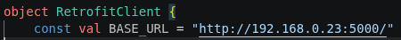
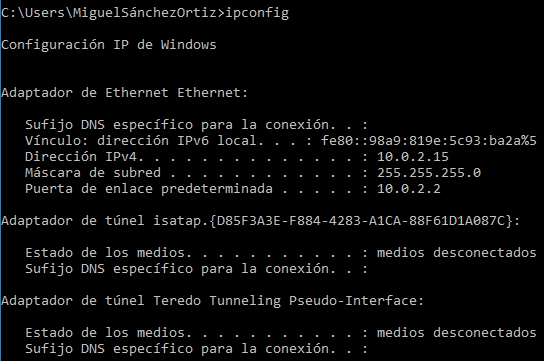

#CazaBaches

Instalacion

	1. Instalarse xampp:https://www.apachefriends.org/es/download.html
	2. Instalarse el repo o clonarlo:
						A)en consola tener configurado git
						B)git clone --branch WIP --single-branch https://github.com/jabali777/CazaBaches.git
	3. Abrir Visual studio code
	4. Ir a Retrofit y poner tu IP LOCAL o PUBLICA aqui:
		

		
					
		A)Para ver tu IP en windows es asi

				

	5.Ir a el directorio backend, luego ir a app.py y ejecutarlo
	6.Abrir XAMPP y prender apache, mysql
	7. 
